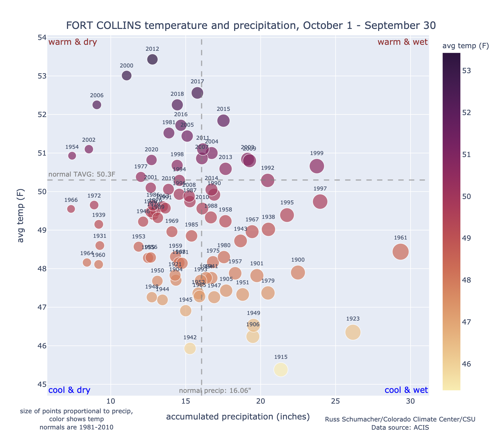

# acis_temp_precip_scatter

This python code pulls temperature and precipitation data for user-defined stations over a user-defined time period from ACIS, then uses plotly to generate scatterplots.

Requires json, pandas and plotly to be installed, as well as [kaleido](https://plotly.com/python/static-image-export/]) if you want to write the plots to image files.

The code is in the jupyter notebook included here, the only changes a user needs to make are to include the desired station ID(s), and to define the desired start and end dates for the period of interest.

The resulting plots look will look something like this (if using Fort Collins, CO and the full water year):

